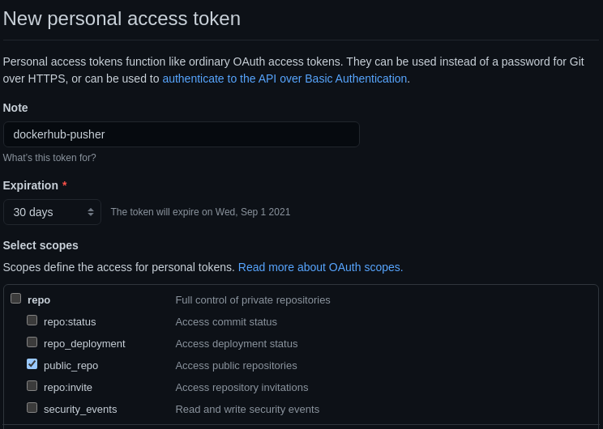

# DockerHub Pusher

Script that downloads a repository from github, builds a Dockerfile located in the root and then publishes it into Docker Hub.

## Setup guide:

You need to create 3 files in the root directory that have correct values in them. 
1. GITHUB_TOKEN
2. HUB_USERNAME
3. HUB_PASS


#### GITHUB_TOKEN

Go to Github > Settings > Developer settings > Personal access tokens > Generate new token



You need to give it access to public repositories like in the screenshot.  

#### HUB_USERNAME

This is the username you have at Docker Hub. 
This will be used when the image is pushed into Docker Hub. 
The images tag will be HUB_USERNAME/project_name. 
Project name is given when the docker image is run.

#### HUB_PASS

This can be either your Docker Hub password or a Docker Hub token. This is used to authenticate the push to Docker Hub. 

## Running the app

```
docker built . -t dockerhub-pusher
docker run --rm -v /var/run/docker.sock:/var/run/docker.sock dockerhub-pusher -d GITHUB_LINK -n NAME
```
where `GITHUB_LINK` needs to be substituted by the HTTPS link to the repository and `NAME` will be used for the repo name in Docker Hub.

